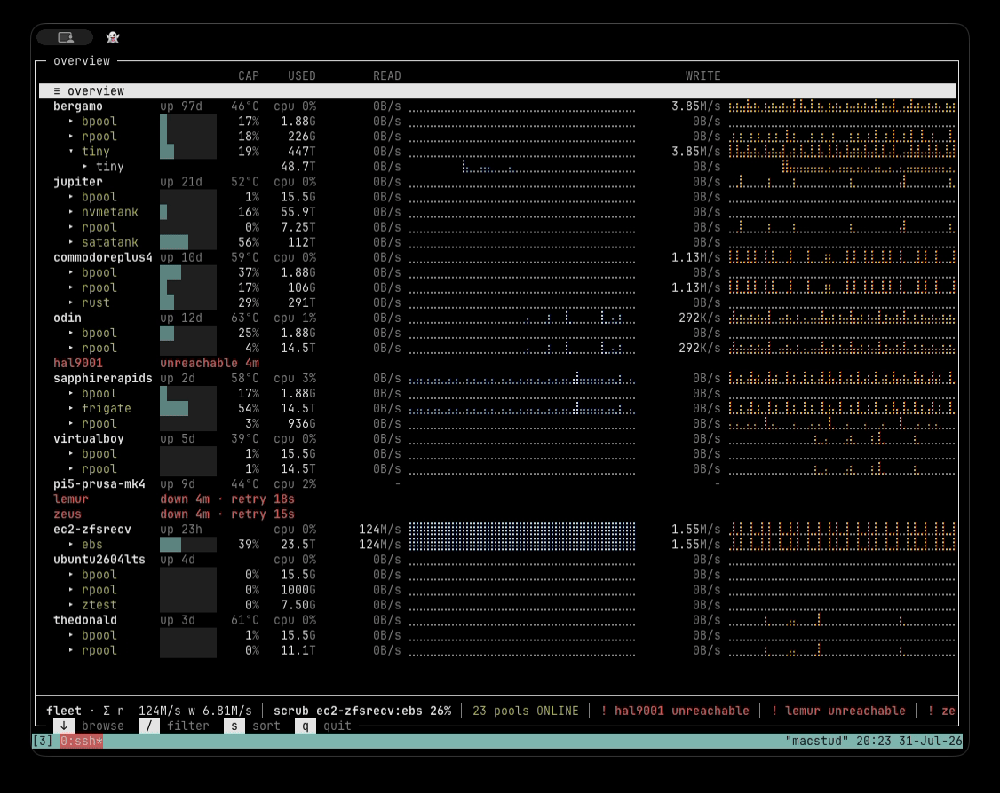
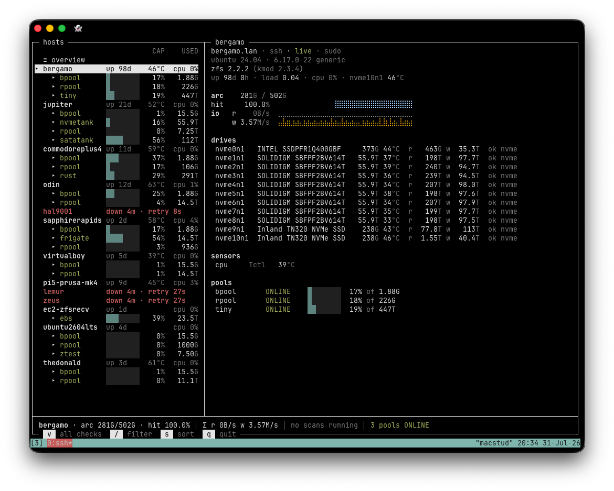
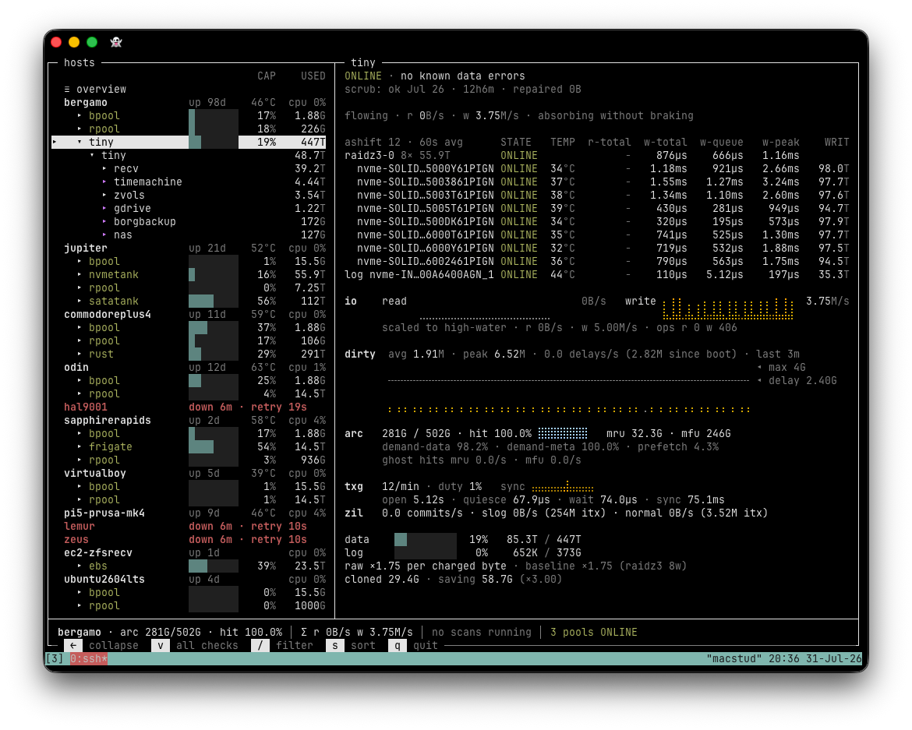

# zfleet

A terminal UI for browsing, diagnosing, and operating a fleet of ZFS hosts
over ssh — pools, datasets, snapshots, drives, and their live IO, in one tree.



## What it does

- **One tree for the whole fleet**: hosts, pools, datasets, snapshots —
  with live IO sparklines, capacity bars, and health rolled up the tree
  (a failing drive colors its pool, the pool colors its host).
- **Host inspector**: vitals, ARC, sensors, and a drive roster with SMART
  verdicts — warned drives auto-expand their full check ledger, no
  navigation needed.
- **Pool inspector**: topology with per-vdev verdicts, temps, latency
  windows and lifetime odometers; TXG/dirty/ARC engine room below.
- **Fleet-wide snapshot search** (`/`): find that dataset or snapshot
  across every pool on every host, then act on the results.
- **Multi-select destroy**: mark snapshots and datasets anywhere in the
  fleet, see the exact reclaim priced by dry-run, then pull the trigger.
- **Warnings inbox** (`a`): every SMART warning and pool error counter in
  one popup — acknowledge the ones you've judged benign, clear the
  counters you've investigated.



## Safety model

zfleet is read-only by default. Exactly two write operations exist:

- `zfs destroy` — only through the F8 popup, only on rows you  marked, priced
  by a `destroy -n` dry-run first, and the popup shows the
  verbatim command before you confirm. No `-f`, ever: busy mounts fail. 
  Subtrees containing the running system (`/`, `/boot`) are blocked.
- `zpool clear` — only through the warnings inbox, where the line you
  confirm is the verbatim command.

Everything else — every list, status, iostat, SMART probe — is a read.
Without passwordless sudo on a host, both write paths and SMART data
degrade gracefully; browsing works as an unprivileged user.

## Install

Prebuilt static binaries for Linux are on the
[releases page](https://github.com/martona/zfleet/releases), with GitHub
build attestations:

```sh
gh attestation verify zfleet-linux-amd64 --repo martona/zfleet
```

Or build from source (Go 1.26+):

```sh
go install github.com/martona/zfleet/cmd/zfleet@latest
```

## Quickstart

On a ZFS box, just run it — no config needed:

```sh
zfleet
```

To watch a fleet, list ssh destinations in `~/.config/zfleet/zfleet.conf`:

```ini
[hosts]
root@storage1
marton@backup.lan
10.0.0.7
```

or ad hoc with `--host dest` (repeatable). Remote hosts need ssh key auth,
Linux with OpenZFS 2.x, and `smartctl` for drive health (the latter is optional). 
Passwordless sudo (`sudo -n`) is optional too; it unlocks SMART data and
the two write operations.

## Keys

| key | action |
|-----|--------|
| `↑` `↓` `pgup` `pgdn` | move |
| `→` / `enter` | expand — child datasets first, snapshots after |
| `←` | collapse, or jump to parent |
| `t` | fold/unfold a dataset's snapshots |
| `/` | fleet-wide filter: `ds[@snap]`, substring or glob |
| `space`, `shift+↑/↓` | mark snapshots/datasets for destroy |
| `*` | bulk-toggle everything the filter matched |
| `F8` | destroy popup over the marks (`shift+F8` inside runs all) |
| `a` | warnings inbox — ack SMART findings, clear pool counters |
| `v` | full check ledgers for every drive |
| `j` `k` | scroll the inspector panel |
| `g` `G` | top / bottom |
| `esc` | clear marks, then filter, then popups — one layer at a time |
| `q` | quit |



## Configuration

`~/.config/zfleet/zfleet.conf` (INI, `#` comments). Absent file = sane
defaults; a bad section, key, or duration fails loudly at startup.

```ini
[hosts]
# one ssh destination per line

[collector]
# cadence for hosts the cursor is NOT on (foreground is 2s/5s/60s)
bg-stats = 15s   # vitals, ARC, IO
bg-pools = 60s   # pool status, datasets
bg-disks = 5m    # SMART probes
promote  = 1s    # cursor dwell before a host goes foreground
demote   = 30s   # grace before it drops back
```

SMART acknowledgements live in `~/.config/zfleet/ack.conf` — an
append-only ledger zfleet maintains itself; drives are keyed by
model+serial, so acks travel with the drive across hosts and slots.

## License

MIT — see [LICENSE](LICENSE).
